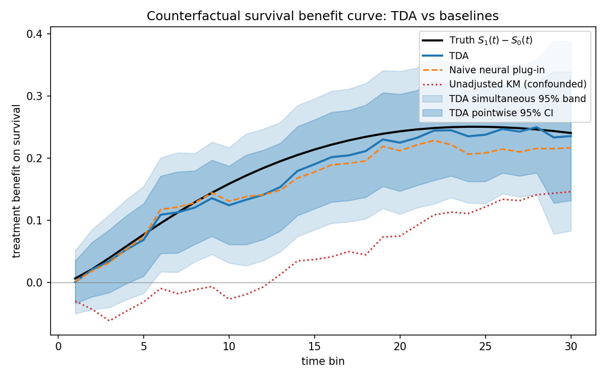
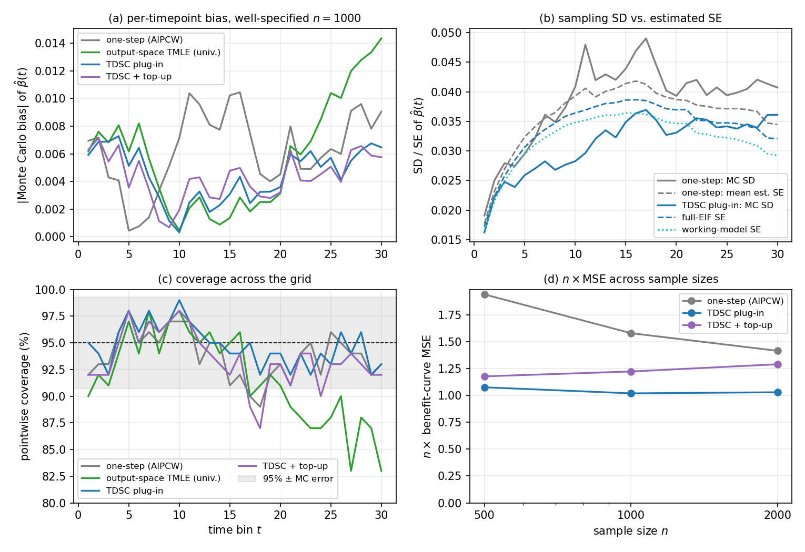
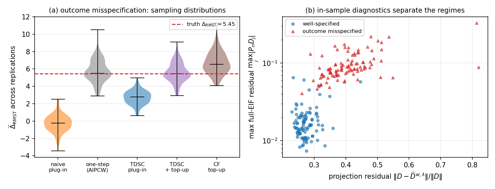

# Targeted Deep Survival Contrasts (TDSC)

**Valid causal inference for treatment-specific survival benefit with neural networks.**

[-b31b1b.svg)](https://arxiv.org/abs/2507.12435)
[](LICENSE)
[](requirements.txt)

TDSC turns a deep survival network into a valid estimator of **population
treatment benefit** — the counterfactual survival curves S₁(t), S₀(t), the
benefit curve S₁(t)−S₀(t), and the RMST difference — under **confounding and
covariate-dependent censoring**, with honest standard errors and
multiplier-bootstrap **simultaneous confidence bands**. Debiasing happens
*inside the network's weight space*: one universal targeting path (a ridge
projection of all 2K stacked efficient influence functions onto closed-form
last-layer gradients) serves the entire curve pair at once.

<p align="center">

</p>

📄 **Paper:** *Targeted Deep Survival Contrasts: Valid Inference for
Treatment-Specific Survival Benefit with Neural Networks*
(McCoy, Li & van der Laan) — [`paper/main.pdf`](paper/main.pdf).
Extends [Targeted Deep Architectures](https://arxiv.org/abs/2507.12435)
(TDA) from single targets to a 2K-dimensional survival contrast.

---

## Why

Networks trained for predictive loss are biased, inefficient estimators of any
low-dimensional causal functional, and their naive uncertainty is invalid.
Standard fixes (one-step/AIPCW, classical TMLE) correct *outside* the model
and get awkward for a whole vector of targets. TDSC keeps the correction
inside the architecture: the fitted network **is** the debiased estimator, its
curves stay monotone by construction, and one ridge regression per targeting
iteration debiases all 2K coordinates simultaneously.

Two estimators come out, with an honest division of labor:

| | estimand | when to use |
|---|---|---|
| **plug-in** | working parameter of the network submodel | best MSE + nominal coverage when the outcome model is adequate (superefficiency) |
| **+ residual top-up** | unrestricted causal target | provably regular & doubly robust; the insurance instrument |

Built-in diagnostics (the top-up magnitude and the EIF projection residual)
tell you — in-sample, without knowing the truth — which regime you are in.

## Key results

All numbers from the unified simulation banks in [`results/`](results/)
(confounded treatment, sign-varying effect heterogeneity, censoring dependent
on treatment and covariates; every estimator on identical data and, where
applicable, identical nuisance fits).

- **Well-specified (n=1000, K=30):** TDSC plug-in reaches **94.8% pointwise /
  95.0% simultaneous coverage** with **35% lower MSE** than a per-timepoint
  one-step (AIPCW) built from the same nuisances (0.00102 vs 0.00158), with
  narrower intervals. The advantage is uniform across the time grid and
  persists for n ∈ {500, 1000, 2000}, a nonlinear design, and two orders of
  magnitude of ridge penalty.

<p align="center">

</p>

- **Outcome misspecification — the two-estimator story:** the plug-in
  faithfully estimates its *working* parameter and misses the truth (44%
  coverage); the residual top-up restores the causal target to nominal
  (93.6–95.2%). The in-sample diagnostics separate the two regimes
  replication by replication.

<p align="center">

</p>

- **Mechanism decomposition:** one-step → output-space TMLE → TDSC each buys
  roughly half of the total gain; monotonicity alone contributes nothing
  (isotonized one-step ties the raw one-step); causal survival forests carry
  visible regularization bias into this population-level target.

## Layout

```
tdsc/dgp.py            confounded, censored discrete-time DGP + exact truth
tdsc/model.py          DragonSurv + CensNet + PropNet, training, nuisance extraction
tdsc/influence.py      stacked EIFs for S_a(t); benefit-curve and RMST contrasts
tdsc/targeting.py      universal TDA targeting loop (closed-form last-layer gradients)
tdsc/estimators.py     naive plug-in, one-step AIPCW (+isotonized), (IPCW-)KM, TDSC
tdsc/ostmle.py         output-space survival TMLE (per-timepoint + universal path)
tdsc/crossfit.py       V-fold cross-fitted TDSC (train+target off-fold, exact residual on-fold)
tdsc/bands.py          IF-based SEs, multiplier-bootstrap sup-t bands
tdsc/metrics.py        Monte Carlo bias/variance/MSE/coverage aggregation

scripts/run_bank.py            unified paired simulation bank (one config = scenario × design × n × K)
scripts/run_single.py          one dataset + the benefit-curve figure
scripts/run_comparators.py     shared-data comparator study (+ causal survival forest bridge)
scripts/csf_bridge.R           causal survival forests via grf
scripts/make_tables.py         summaries → results/tables_generated.tex
scripts/plot_paper_figures.py  grid-calibration + misspecification-story figures
scripts/plot_comparators.py    cross-scenario comparator figure

paper/main.tex         manuscript source (paper/main.pdf compiled)
results/               raw Monte Carlo stores (.npz) + summaries (.json) behind every table
```

## Install

```bash
pip install -r requirements.txt          # numpy, torch, matplotlib
# optional, for the causal survival forest comparator:
Rscript -e 'install.packages("grf")'
```

## Quickstart

```bash
python scripts/run_single.py --n 1000 --K 30
# trains the nets, targets, prints estimates ± simultaneous band,
# writes figures/benefit_curve.png
```

## Reproduce the paper

Every table and figure is backed by a store in `results/` (kept in this repo),
so `make_tables.py` and the plotting scripts run without re-simulating.
To regenerate from scratch (all runs checkpoint per replication and resume
via `--start`):

```bash
# Table 1 + Figs 3, 6 — well-specified main bank (incl. cross-fitted arms)
python scripts/run_bank.py --scenario well --design linear --n 1000 --reps 100 --cf

# Table 2 + Fig 5 — nuisance misspecification
python scripts/run_bank.py --scenario outcome_mis --design linear --n 1000 --reps 100 --cf
python scripts/run_bank.py --scenario weights_mis --design linear --n 1000 --reps 150

# Table 3 — sample-size scaling, robustness designs, ridge sweep
python scripts/run_bank.py --scenario well --design linear --n 500  --reps 100 --cf
python scripts/run_bank.py --scenario well --design linear --n 2000 --reps 100
python scripts/run_bank.py --scenario well --design nonlinear --n 1000 --reps 150
python scripts/run_bank.py --scenario well --design nearpos   --n 1000 --reps 100
for r in 0.001 0.003 0.03 0.1; do
  python scripts/run_bank.py --scenario well --design linear --n 1000 --reps 60 \
         --ridge $r --tag ridge_$r
done

# Comparators (causal survival forest; shares data seeds with the banks)
python scripts/run_comparators.py --reps 100

# Tables + figures from the stores
python scripts/make_tables.py
python scripts/plot_paper_figures.py
python scripts/plot_comparators.py
```

## Practical protocol

Fit both estimators and let the **top-up magnitude** (max |Pₙ Dⱼ|, reported by
the targeting loop) arbitrate: when it is small, the plug-in's sharper
intervals are trustworthy; when it is large, the working submodel has drifted
from the causal target — report the top-up. In our banks the two regimes are
nearly disjoint in diagnostic space (see figure above).

## Citation

```bibtex
@unpublished{mccoy2026tdsc,
  title  = {Targeted Deep Survival Contrasts: Valid Inference for
            Treatment-Specific Survival Benefit with Neural Networks},
  author = {McCoy, David and Li, Yi and van der Laan, Mark J.},
  note   = {Working paper},
  year   = {2026}
}

@article{li2025tda,
  title   = {Targeted Deep Architectures: A {TMLE}-Based Framework for Robust
             Causal Inference in Neural Networks},
  author  = {Li, Yi and McCoy, David and Gunter, Nolan and Lee, Kaitlyn and
             Schuler, Alejandro and van der Laan, Mark J.},
  journal = {arXiv preprint arXiv:2507.12435},
  year    = {2025}
}
```

## License

MIT — see [LICENSE](LICENSE).
Division of Biostatistics, University of California, Berkeley.
